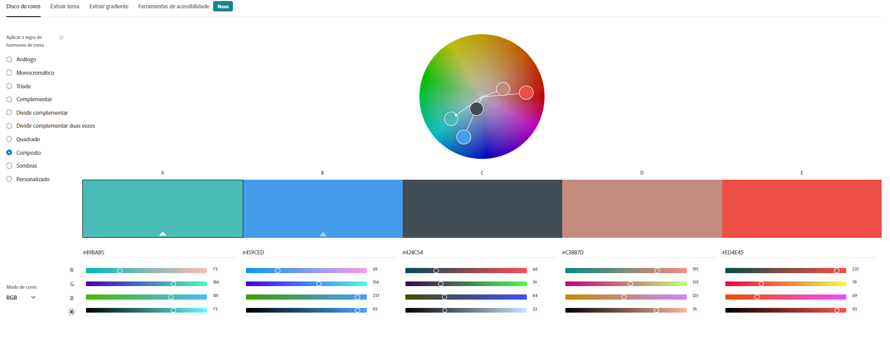

# Sejam todos bem-vindos e bem-vindas ao nosso E-commerce.

Optamos por fazer um E-commerce de viagens espaciais, que se chama SpaceTrip.

# Logo

A nossa logo foi feita pela Ziza, sobrinha da Raquel, exclusiva para o nosso E-commerce. O trabalho dela pode ser conhecido no instagram https://www.instagram.com/aaaash_a4/.

# Informações sobre o projeto

Na Home são mostrados os cards com todas as viagens disponíveis, que são os produtos oferecidos por nós.
Em cada card é mostrado o nome, descrição, preço e imagem do produto.

Existe também em cada card, um botão de "Adicionar ao Carrinho". Ao clicar nele, é exibido um alert que indica ao usuário que o produto foi adicionado ao carrinho.

Fizemos um footer em que o usuário encontra os ícones das redes sociais. Clicando em cada um deles, é aberto o link em outra página da rede social escolhida.

##No carrinho
Ao cliclar no ícone do carrinho o usuário pode verificar o produto e a quantidade de vezes que ele foi adicionado e, se o usuário quiser, existe a opção de remover os itens do carrinho, um a um.
No carrinho o usuário também pode verificar o valor total dos produtos adicionados.

##Nos filtros
Existe a opção de o usuário ordenar os produtos por preço (crescente ou decrescente).
O usuário pode procurar os produtos por valor mínimo e máximo e também por nome.

##Desafios
Implementamos o desafio de recuperar o conteúdo do carrinho usando o LocalStorage, então quando a página é atualizada, os itens do carrinho permanecem lá.
Fizemos também um seção com depoimentos de usuários que já utilizaram o serviço, desenhos feitos também pela Ziza. 

##Design
Utilizamos a seguinte paleta de cores gerada através da roda de cores do site da Adobe:

# Conheça nosso E-commerce

<http://star-trip-alves.surge.sh/>

# Integrantes

Lucas Magalhães,
Nicole Prim,
Raquel Baptista Burger

# Desenvolvimento do projeto

Praticamente o projeto todo foi realizado em pair programing. Todas as decisões foram tomadas em conjunto. A comunicação entre o grupo é muito tranquila, cada um respeita a dificuldade do outro e se coloca a disposição para ajudar. Ficamos feliz com o resultado final.
